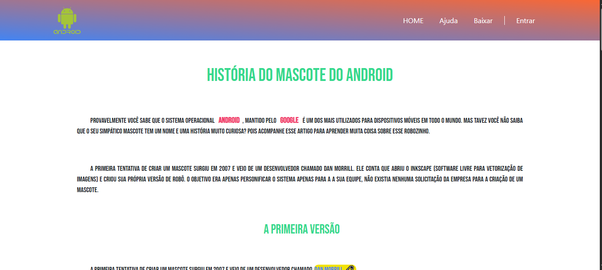

<h2 id="sobre-o-projeto">1. 🤖 Curiosidades Android: Uma Viagem no Tempo 🚀</h2>


[](https://github.com/Domisnnet/Android-Web-Essentials/blob/main/LICENSE)



Bem-vindo ao **Curiosidades de Tecnologia Android**! Este projeto é uma experiência interativa que explora a história do Bugdroid, os famosos mascotes verdes criados por Irina Blok. Mergulhe na filosofia de código aberto, descubra o significado por trás dos nomes de doces e entenda a evolução visual do sistema mobile mais usado do mundo.

---

## 📚 Tabela de Conteúdo

| 🤖 O Projeto | 🛠️ Técnico | 🤝 Comunidade |
| :---: | :---: | :---: |
| [](#sobre-o-projeto) | [](#destaques-tecnicos) | [](#codigo-fonte) |
| [](#tecnologias-utilizadas) | [](#instalacao) | [](#créditos) |
| [](#como-acessar) | [](#como-contribuir) | [](#licenca) |
| [](#funcionalidades) | [](#faq) | [](#perfil-do-github) |

---

<h2 id="tecnologias-utilizadas">2. ⚙️ Tecnologias Utilizadas</h2>

| Camada | Tecnologias | Descrição |
| :--- | :--- | :--- |
| **Frontend** |   | Estrutura semântica e estilização para uma leitura fluida. |
| **Framework** |  | Componentes responsivos e sistema de grid. |
| **Ícones** |   | Tipografia visual e ícones técnicos personalizados. |

---

<h2 id="como-acessar">3. 🚀 Como Acessar</h2>

Clique no botão abaixo para iniciar sua viagem no tempo pelo universo Android:

<div align="left">
  <a href="https://domisnnet.github.io/Android-Web-Essentials/" target="_blank">
    
  </a>
</div>

---

<h2 id="funcionalidades">4. 🧩 Funcionalidades Principais</h2>

O projeto oferece uma curadoria rica sobre a história do sistema:

| Funcionalidade | Descrição |
| :--- | :--- |
| 📜 **História do Bugdroid** | Linha do tempo detalhando a criação por Irina Blok. |
| 🍬 **Guia de Versões** | Catálogo interativo das versões clássicas (Cupcake ao Pie). |
| 🎥 **Bastidores em Vídeo** | Integração de mídia para explicar a inspiração do robozinho. |
| 📱 **Design Adaptável** | Experiência otimizada para Desktop, Tablets e Smartphones. |
| 🔗 **Links de Referência** | Conexão com documentos oficiais e Wikipedia para estudo aprofundado. |

---

<h2 id="destaques-tecnicos">5. 💻 Destaques Técnicos</h2>

A construção focou em acessibilidade e organização de conteúdo:

### 📐 Estrutura com Bootstrap 4
Uso de utilitários de margem, preenchimento e containers para garantir que o conteúdo rico em texto não se torne cansativo, mantendo a hierarquia visual.

### 🎥 Incorporação de Mídia
Implementação de visualização de vídeos do YouTube com capas responsivas, garantindo que o carregamento da página permaneça ágil.

---

<h2 id="instalacao">6. 🚀 Instalação e Configuração Local</h2>

Deseja explorar os bastidores do código ou contribuir? Acesse o repositório:

```bash
# Clonar o repositório
git clone https://github.com/Domisnnet/Android-Web-Essentials.git(https://github.com/Domisnnet/Android-Web-Essentials.git)

# Acessar a pasta
cd Android-Web-Essentials
```

---

<h2 id="como-contribuir">7. 🤝 Como Contribuir</h2>

Siga os passos abaixo para fortalecer este deck de informações:

| Fase | Ação | Link / Comando |
| :---: | :--- | :--- |
| **01** | **Fork** | [](https://github.com/Domisnnet/Android-Web-Essentials/fork) |
| **02** | **Branch** | `git checkout -b feature/NovaCuriosidade` |
| **03** | **Commit** | `git commit -m 'feat: adição da versão Android 14'` |
| **04** | **Push** | `git push origin feature/NovaCuriosidade` |
| **05** | **PR** | [](https://github.com/Domisnnet/Android-Web-Essentials/compare)

### 🐛 Encontrou um problema?
Se algo não estiver funcionando como esperado, não hesite em abrir um chamado:

[](https://github.com/Domisnnet/Android-Web-Essentials/issues)
[](https://github.com/Domisnnet/Android-Web-Essentials/issues/new)

---

<h2 id="faq">8. 🧠 Perguntas Frequentes (FAQ)</h2>

<details>
<summary><strong>Este projeto está finalizado ❓</strong></summary>
<p>🛠️ <strong>Resposta:</strong> Não. Este é um projeto base em constante evolução. Próximas atualizações incluem mapas interativos e um sistema de comentários por versão.</p>
</details>

<details>
<summary><strong>Por que as versões tinham nomes de doces ❓</strong></summary>
<p>🍬 <strong>Resposta:</strong> Era uma tradição interna do Google que seguia a ordem alfabética. No FAQ interativo do site, você encontra o link para cada doce específico na Wikipedia.</p>
</details>

<details>
<summary><strong>Posso usar este código para meu blog ❓</strong></summary>
<p>🤝 <strong>Resposta:</strong> Sim! O projeto é Open Source sob a licença MIT. Lembre-se apenas de atribuir os créditos ao desenvolvedor original.</p>
</details>

---

<h2 id="codigo-fonte">9. 💻 Código Fonte</h2>

Explore a estrutura de pastas e componentes:

[](https://github.com/Domisnnet/android/tree/main)

---

<h2 id="créditos">10. 📝 Créditos & Reconhecimentos</h2>

Este projeto une história e tecnologia:

| Atribuição | Responsável / Recurso | Descrição |
| :--- | :--- | :--- |
| **Desenvolvedor** | **DomisDev** | Criação da interface e curadoria histórica do projeto. |
| **Mascote Design** | **Irina Blok** | Design original do Bugdroid utilizado como base. |
| **Framework** | **Bootstrap** | Componentes de estilo e responsividade. |
| **Apoio Técnico** | **Google Gemini** | Suporte na organização de documentação e FAQ. |

### 🎯 Missão do Projeto
> "Construir uma ponte entre o usuário atual e as raízes do sistema Android, celebrando a evolução do design e a filosofia Open Source."

---

<h2 id="licenca">11. 📄 Licença</h2>

Este projeto está licenciado sob a [](https://github.com/Domisnnet/Android-Web-Essentials/blob/main/LICENSE)

---

<h2 id="perfil-do-github">12. 👨‍💻 Perfil do GitHub</h2>

<a href="https://github.com/Domisnnet"> 
   
</a>